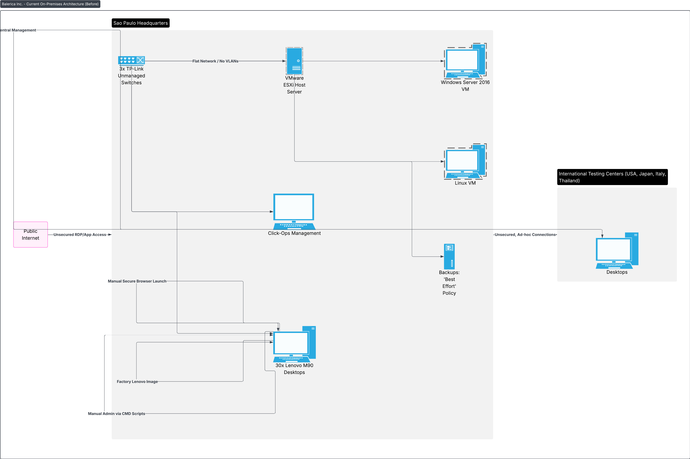

# Balerica Inc. Cloud Migration Strategy

**Author:** Cameron Cleveland
**Date:** August 29, 2025
**Project:** Individual Armageddon - Cloud Migration Strategy

## Project Overview

Balerica Inc., an educational services provider headquartered in Sao Paulo, sought to modernize its IT infrastructure, expand globally, and enhance security. This project outlines a comprehensive migration strategy from their existing on-premises setup to a secure, automated, and scalable environment on **Amazon Web Services (AWS)**.

### Goals
- Automate deployment and management processes.
- Reduce or eliminate "click-ops" administration.
- Enable secure remote control capabilities for administrators.
- Drastically reduce desktop reimaging times.
- Develop a scalable, secure browser for certification tests.
- Establish a secure, redundant global network connecting testing centers in 5 countries.

## Current State Analysis

The following diagram illustrates Balerica's existing on-premises network topology, which is manual, fragile, and not built for scale.

### Diagram Explanation & Key Issues:
*   **Flat Network:** All devices reside on a single network segment connected via **unmanaged TP-Link switches**, creating a major security risk where a breach on one device could compromise all assets.
*   **Manual Processes:** The workflow is characterized by **"click-ops"**—manual administration via CMD scripts, best-effort backups, and manual deployment of the secure exam browser.
*   **Lack of Central Management:** There is no central codebase or configuration management. **International testing centers** have no standardized, secure connection to the Sao Paulo HQ, relying on insecure, ad-hoc links.
*   **Desktop Management Overhead:** Reimaging the 30+ Lenovo M90 desktops is a slow, manual process using the factory Lenovo image.

## Future State Recommendation: AWS Architecture

The proposed future state leverages Amazon Web Services to create a resilient, automated, and globally scalable infrastructure that addresses all of Balerica's expressed goals.

### Diagram Explanation & Networking Choices:

This architecture is built on a **global hub-and-spoke model** using AWS's enterprise-grade services.

**1. Global Network & Security:**
*   **AWS Transit Gateway:** This acts as the central cloud router, simplifying connectivity between all regional VPCs and on-premises locations. It provides a scalable and managed hub for a secure global network.
*   **Hybrid Connectivity:** The São Paulo HQ uses **AWS Direct Connect** for a high-bandwidth, low-latency dedicated network connection, with a backup **AWS Site-to-Site VPN** for failover. Global testing centers connect via Site-to-Site VPN to their nearest AWS region. This meets the requirement for **secure and redundant communications**.
*   **Zero Trust Security:** **AWS Systems Manager Session Manager** is implemented for all remote administration. This ensures that **no EC2 instances require open inbound ports (SSH/RDP)**, as access is brokered through AWS's secure APIs. This fulfills the goal of "secure remote control capabilities for administrators only."

**2. Automation & Modernization:**
*   **Amazon ECS (Elastic Container Service):** The homegrown secure browser is **containerized** and runs on this fully managed container orchestration service. It automatically handles deployment, scaling, and management of the browser backend, making it highly scalable and reliable.
*   **Infrastructure as Code (IaC):** The entire environment can be provisioned using AWS CloudFormation or Terraform, eliminating manual "click-ops" and ensuring consistent, repeatable deployments.
*   **Amazon WorkSpaces:** The existing Lenovo desktops are used as thin clients to access cloud-hosted virtual desktops. A single "golden image" of the secure browser environment is maintained, allowing for instant, centralized deployment and "reimaging" in seconds by simply rebooting the virtual desktop.

**3. Resilience and Performance:**
*   **Application Load Balancer:** Users worldwide connect to a secure endpoint provided by the ALB, which automatically distributes exam traffic across the healthy container instances in multiple Availability Zones, ensuring high availability and performance.
*   **Managed Services:** Using **Amazon RDS** (Relational Database Service) and **Amazon EFS** (Elastic File System) ensures databases and shared storage are highly available, scalable, and automatically backed up, moving away from the on-premises "best effort" policy.

## Conclusion

This migration strategy transforms Balerica Inc. from a manually-intensive, geographically-limited operation into a fully automated, secure, and global organization capable of scaling effortlessly to meet its business goals. The choice of **Amazon Web Services** provides a robust, secure, and comprehensive foundation for this transformation.
